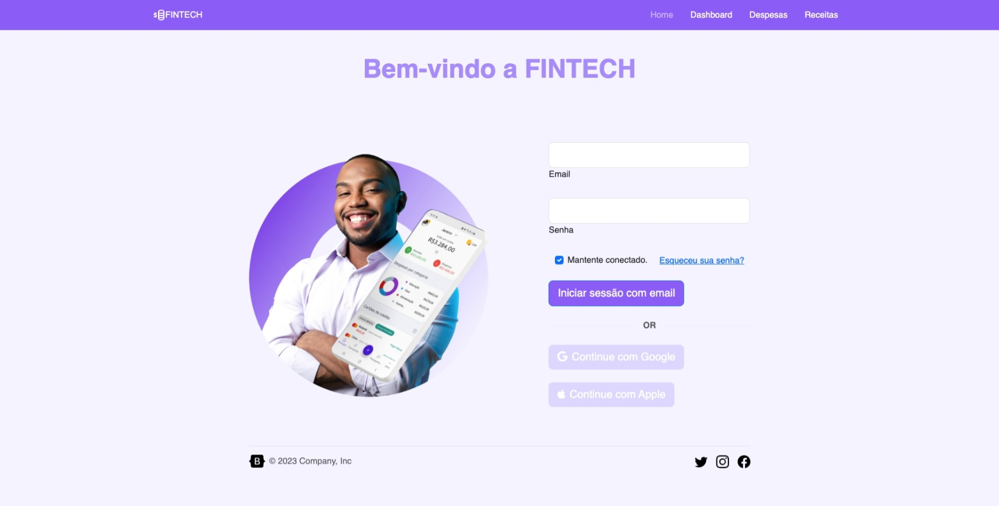

# Projeto fintech - FIAP

## Acesse o projeto

- https://fintech-abimael-rm554116.netlify.app/

### Tecnologias utilizadas

### Link Github

- https://github.com/Abimael-Lovera/fintech-project

### Tela 1

### Tela 2

